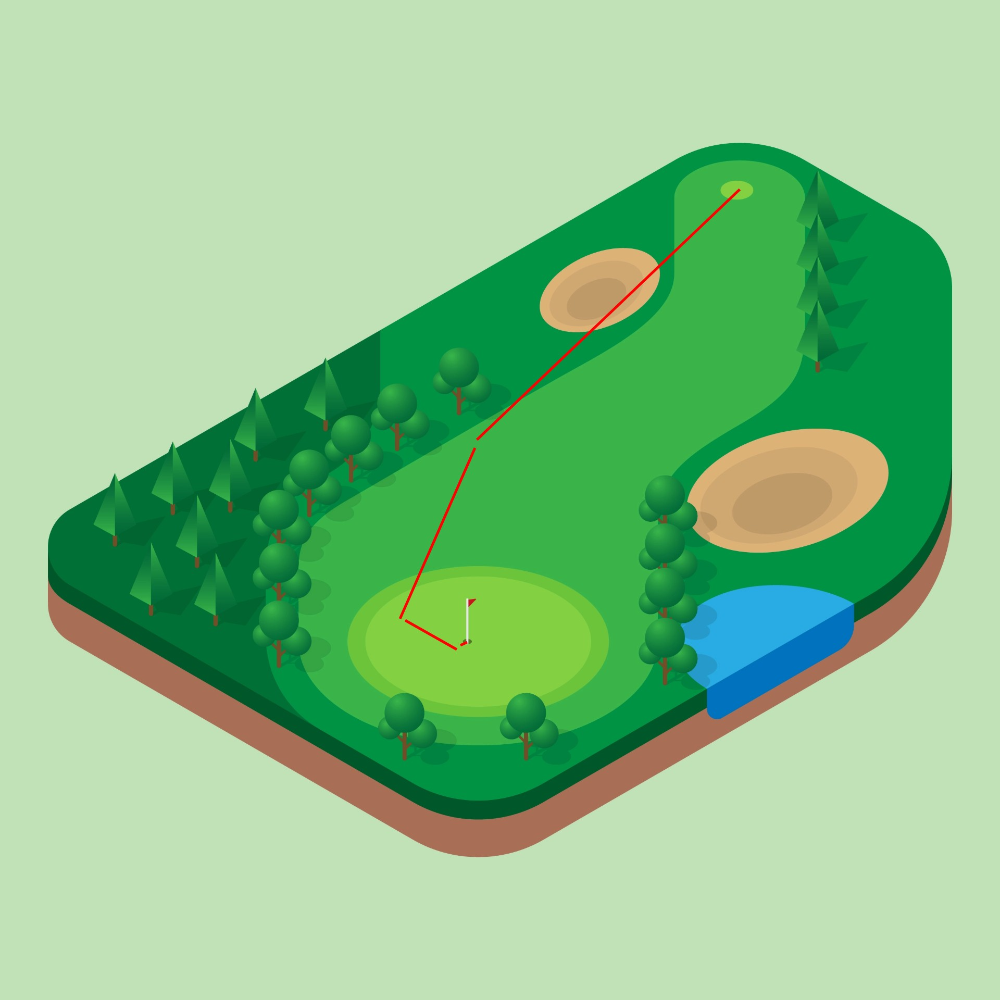

### LeanAP + Shared Workspace WIP Demo

---

### Purpose

Goal:
@ul
- Feature set triangulation
@ulend

Success:
@ul
- narrowing the feature space
- decreasing unknowns
@ulend

Note:
  _Still need to build it for real._
  Style is not a focus.

---

### Metaphor

Note:
  Think about this like a hole in golf.  You start with bigger, less accurate shots, and use smaller, more accurate shots until you hit your objective.  _It is important the objective does not move_.

---

### Agenda

@ul
- share feature (10min)
- questions (5-10min)
- funretro cards (5-10min)
- discussion (< 20min)
- next steps (< 10min)
@ulend
